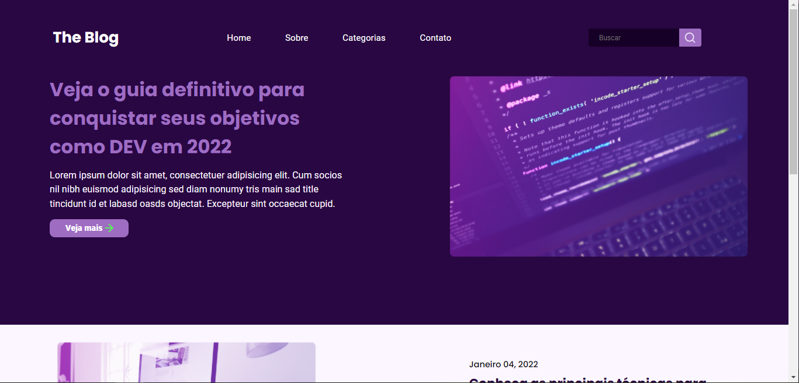
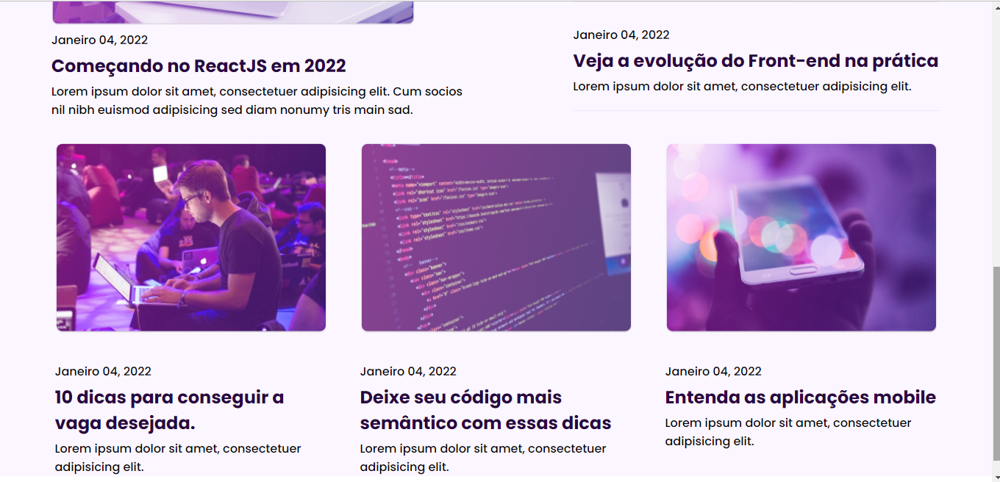

# RocketBlog

<!---Esses são exemplos. Veja https://shields.io para outras pessoas ou para personalizar este conjunto de escudos. Você pode querer incluir dependências, status do projeto e informações de licença aqui--->

> Challenge of Homepage for a Blog, prototyped in Figma by RocketSeat.

Link da aplicação: <a>http://jgsl-rocketblog.netlify.app</a>
### ⚙️ Adjustments and improvements

The project has been finished.

- [x] Body with HTML.
- [x] Stylization with CSS.
- [x] Responsiveness
## 🤝 Collaborator

<table>
  <tr>
    <td align="center">
      <a href="#">
         
        
          <b>João Guilherme</b>
        
      </a>
    </td>
  </tr>
</table>

## 👨‍💻 Technologies
Technologies used in the project:

## Credits

> RocketSeat
 
- Figma: <a>https://www.figma.com/file/x41bsA5naSfXZRPESu06xl/DD-%2F-RocketBlog-(Copy)?node-id=312%3A152</a>
 
- Challenge Link: <a>https://app.rocketseat.com.br/discover/challenges/rocketblog</a>